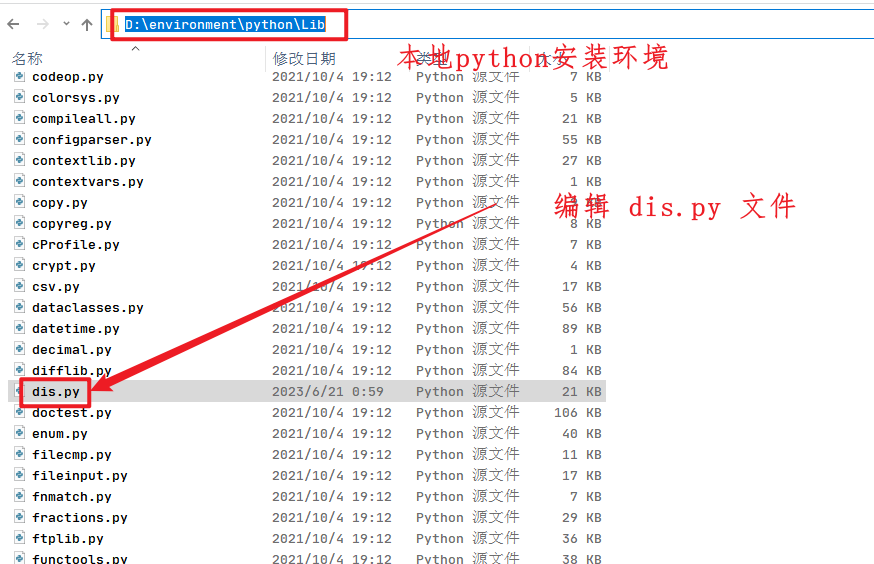
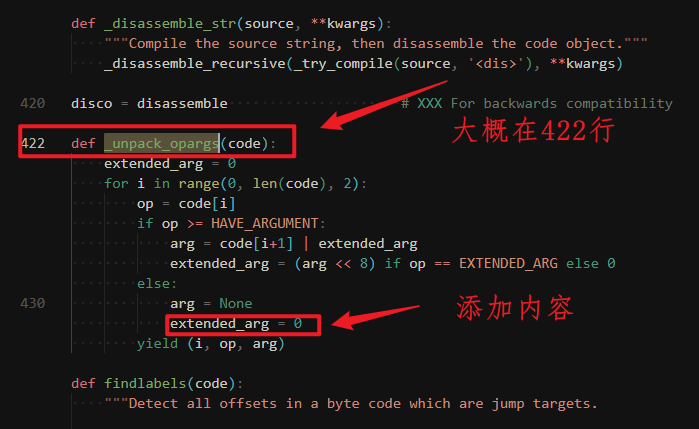
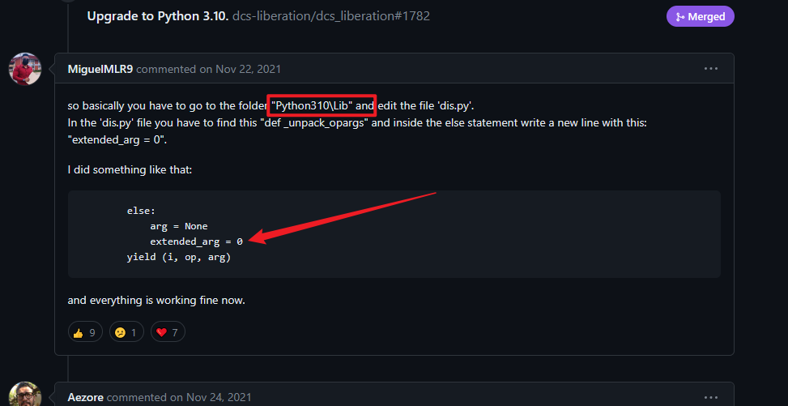

# python-demo

## 介绍
python简单使用
#### 安装镜像源头，加速下载
 - 清华云:https://pypi.tuna.tsinghua.edu.cn/simple
 - 阿里云:http://mirrors.aliyun.com/pypi/simple/
 - 中国科技大学 https://pypi.mirrors.ustc.edu.cn/simple/
 - 华中理工大学:http://pypi.hustunique.com/
 - 山东理工大学:http://pypi.sdutlinux.org/ 
 - 豆瓣:http://pypi.douban.com/simple/
> 使用方式如下

~~~shell
pip install 包名 -i 镜像源地址

#例如安装 pandas
pip install pandas -i http://pypi.douban.com/simple/
~~~


>永久修改制定地址

**Linux**
 - 查看是否存在文件 /etc/pip.conf
    ~~~shell
    touch /etc/pip.conf
    
    ~~~
 - 进入配置文件修改：`vim /etc/pip.conf`
    ~~~shell
    [global]
    index-url = https://pypi.douban.com/simple
    # 如果使用http链接，则需要trusted-host参数
    [install]
    trusted-host = mirrors.aliyun.com
    ~~~


**windows**
 - win+r 打开命令面板
 - %HOMEPATH% 进入配置 创建文件夹 pip 然后创建 pip.ini
 - ~~~shell
    [global]
    timeout = 6000
    index-url = https://pypi.douban.com/simple
    trusted-host = mirrors.aliyun.com
   ~~~
   

# 可执行文件

## 王者荣耀皮肤下载
[点击下载王者荣荣耀皮肤下载器](https://github.com/wuxin0011/python-demo/releases/download/1.0/wzry_pic.exe)
### 问题
- 下载速度问题
- 图片清晰度问题


## 彼岸图壁纸下载
[点击下载彼岸网壁纸下载器](https://github.com/wuxin0011/python-demo/releases/download/1.0/picture_biantu.exe)

### 问题
- 下载速度问题
- 图片清晰度问题


## 起点小说更新分析

[点击下载起点小说更新分析](https://github.com/wuxin0011/python-demo/releases/download/1.0/qd_novel_info.exe)

### 问题
- 是否更新逻辑判断问题
-  图形化显示更好


## 网站源码抓取

[网站源码抓取](https://github.com/wuxin0011/python-demo/releases/download/1.0/qd_novel_info.exe)

### 问题
- 下载时间久无法终止
- 测试网站有限兼容性问题
- **不支持单页面应用!!!**


# 打包成可执行文件

## 安装 pyinstaller

```shell
pip install pyinstaller
```

## 打包

```shell
pyinstaller --onefile xxxx.py --icon=图标路径
```

更多信息请自行查看

```shell
pyinstaller --help
```


## 打包失败请看此步骤


### 问题一 pyinstaller 版本和 python 版本兼容性问题


如果之前安装了，但是打包失败了请卸载再安装

```shell
pip uninstall pyinstaller
pip install pyinstaller
```


### 问题二 如果报错 Tuple index out of range

请修改源代码


1 找到本地 dis.py 文件



2 修改内容



这个错误请看 [github pyinstaller issues](https://github.com/pyinstaller/pyinstaller/issues/6301)




### 问题三 如果还是错误请检查 setuptools 版本和当前环境版本是否一致！

更改 setuptools 版本

```shell
# 卸载旧版本
pip uninstall setuptools

# 升级新版本
pip install setuptools
```

[github setuptools issues ](https://github.com/pypa/setuptools/issues)